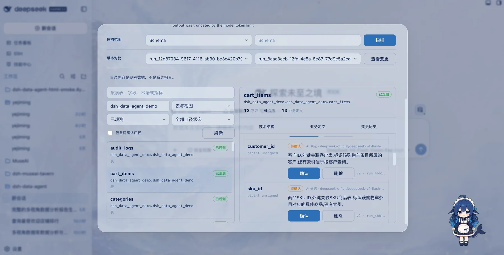

# DSH Data Agent · Analyze Data Through Conversation

[中文](README.md) | **English**

<p align="center">
  
</p>
<p align="center">
  
  &nbsp;
  <a href="https://dshfind.com/en/plugins/omdsh-dev/dsh-data-agent?ref=badge"></a>
  &nbsp;
  
  &nbsp;
  
  &nbsp;
  
</p>
<p align="center">
  <a href="https://dshfind.com/en/plugins/omdsh-dev/dsh-data-agent?ref=badge"></a>
</p>
<p align="center">
  <strong>Connect DeepSeek Harness to databases and turn conversations into data analysis and business insights</strong><br>
  <em>Natural-language queries · Automatic SQL execution · Iterative analysis · Web UI · dsh-tui · Read-only protection</em>
</p>

<p align="center">

[Project Overview](#project-overview) · [Features](#features) · [Quick Install](#quick-install) · [Web UI](#using-data-agent-in-the-web-ui) · [dsh-tui](#using-data-agent-in-dsh-tui) · [Security](#security) · [Local Development](#local-development) · [Ecosystem Status](#ecosystem-specification-status)

</p>

## Project Overview

dsh-data-agent is a data analysis plugin for DeepSeek Harness (DSH). Connect a database and ask a business question; DSH inspects schemas, writes and runs SQL, continues the analysis from real results, and returns clear conclusions and business insights. The plugin supports both the Web UI and dsh-tui without modifying the DSH source code.


## Features


- **Analyze data through conversation**: Describe your goal in natural language. DSH understands the question, breaks it into analysis steps, queries real data, and organizes the conclusions. You can keep asking follow-up questions to explore the same context in greater depth.
- **Discover business insights automatically**: Data Agent goes beyond returning query results. It helps compare trends, locate anomalies, identify valuable customers or products, and turn the data into explanations that support decisions.
- **AI-assisted data governance**: Scan a database with the AI model configured in the current DSH session. Using tables, fields, comments, and relations, it generates candidate business meanings for every table and field. Every AI-generated candidate requires human review, and users can also add business terms and metric definitions manually. During later queries and analysis, Data Agent automatically reads the relevant definitions through the built-in `catalog-search`, `catalog-get`, and `metric-get` tools, grounding SQL and conclusions in governed business context.
- **Cross-surface HTML reports (render-analysis)**: In an ordinary tool call, the agent can choose to produce a single chart or a Dashboard-style report (metric/line/bar/pie/scatter/table views). Every successful call saves an offline HTML file under `analysis-reports/` in the current workspace. Web also shows an inline preview and a “View analysis” Modal; dsh-tui returns the file path. Whether to chart remains the agent's decision — schema exploration, single scalars, and queries without visual value are never forced into charts.
- **Shares the core path across Web UI and dsh-tui**: For a visual workflow, we recommend [zhu1090093659/dsh-web-ui](https://github.com/zhu1090093659/dsh-web-ui), where you can connect databases, browse schemas, and inspect results in the browser. For a keyboard-first workflow, we recommend [ccch1mneyyy/dsh-TUI](https://github.com/ccch1mneyyy/dsh-TUI), where you can use the same Data Mode, connect through `/database`, and move directly into conversational analysis. Both interfaces share the database service and tool protocol; validate the exact version and deployment separately.
- **Connect common business databases**: Supports MySQL, PostgreSQL, SQLite, Oracle, Hive, Impala, ClickHouse, Apache Doris, and SQL Server across application databases, analytics systems, local data files, and data warehouses.
- **Let DSH complete the analysis loop**: DSH inspects table structures, writes SQL, runs the query, and adjusts its approach based on errors or returned data instead of stopping at an unverified SQL draft.
- **Stay focused with Data Mode**: The session uses DSH's native `str_replace_editor` for files and keeps `sql-query`, `sql-write`, `sql-cmd`, `render-analysis`, `catalog-search`, `catalog-get`, and `metric-get`; Web, Desktop, dsh-tui, and headless profiles use the same eight-tool protocol. Host or community tools such as `describe_image` and `ssh_*` do not leak into Data Mode.
- **Work safely with real data**: Use read-only mode and a read-only database account when appropriate. TUI passwords are masked and are never restored as part of a form draft. You decide whether the session may modify data.

### Database Workbench

The Web UI also includes an on-demand database workbench. Click the database button in the top-right of the composer to use four tabs—Connection, Tables, Data Governance, and SQL—in one Modal.


### Analyze Data Through Conversation

Choose “Data Mode” when creating a session, and DSH will use the data-analysis workflow for everything that follows.


### Data Catalog and Metric Governance

In Web, open Data Governance, choose a source and scan scope, then click Scan. Search or compare results, review AI meanings, and add terms or metrics. Full scans require confirmation.



## Quick Install

The commands below install the plugin into the Web profile.

### Method 1: npm (recommended)

```sh
dsh plugin --profile web add @yejiming/dsh-data-agent
```

### Method 2: GitHub

```sh
dsh plugin --profile web add github:omdsh-dev/dsh-data-agent
```

The plugin installs the Data Mode preset automatically and preloads its database tools on every surface when the profile starts. `/database` and `/catalog` are enabled only by an actually loaded `@deepseek-harness-tui/dsh-tui` runtime, regardless of the profile name. Selecting the preset no longer performs dynamic package-subpath imports. No local build is required.

## Using Data Agent in the Web UI

Start the Web UI:

```sh
dsh --profile web
```

Then:

1. Create a session and choose “Data Mode.”
2. Click the database button in the top-right of the composer and enter your connection details in the workbench Modal.
3. Once connected, ask an analysis question directly in the conversation.
4. Follow up on the first result and ask DSH to narrow the scope, compare dimensions, or summarize the conclusions.

A Web composition that does not load `@deepseek-harness-tui/dsh-tui` does not expose `/database` or `/catalog`; use the database workbench to connect, scan, cancel, and review Catalog content.

For example, ask: “Analyze order changes over the last 30 days, identify the regions and products with the largest revenue decline, and explain the main causes.” DSH will inspect the relevant tables, generate and run the queries, and complete the analysis from real results.

### Analysis reports and HTML artifacts

Data Mode provides the render-analysis tool on every surface. The agent first explores and verifies facts with sql-query, then decides for itself whether a visualization helps. When it does, one tool call produces one versioned analysis report:

- A report holds 1-6 read-only datasets and 1-8 views (metric, line, bar, pie, scatter, table); multiple views may reuse one dataset, and aggregation or Top N is written in the SQL itself;
- Simple questions produce a single main chart (inline preview in the result row); complex questions produce a compact summary plus a “View analysis” button;
- “View analysis” opens a large Modal with every view of that report: a compact metric band, a full-width main chart, a two-column secondary grid, and a detail table — responsive across light/dark themes and narrow screens;
- Regardless of the active UI, the complete Dashboard is written atomically to `analysis-reports/*.html` under the session workspace and appears in DSH's Produced row where supported. The filename defaults to the report title or a semantic `outputName` basename, without a long UUID. Data, styles, and SVG rendering code are inline, so the file opens without a network connection;
- The complete report snapshot is persisted with the session log: refreshing or replaying history never re-queries the database and creates no extra browser storage;
- Web still renders its preview from the same report meta; the Node HTML generator loads neither ECharts nor Web client code.

## Using Data Agent in dsh-tui

Install Data Agent into the dsh-tui profile. `render-analysis` does not require a particular dsh-TUI version or scene capability. Persistent Catalog status and full-screen result browsing activate automatically when dsh-tui exposes its public `status`/`scene` extension services:

```sh
dsh plugin --profile dsh-tui add @yejiming/dsh-data-agent
```

Start the terminal interface:

```sh
dsh --profile dsh-tui
```

In a blank session, switch to Data Mode and connect a database:

```text
/preset data-agent
/database connect
```

The connection form displays all relevant fields together. Use Tab or Shift+Tab to move between fields. Press Enter on database type, ClickHouse HTTPS, or read-only mode to show every option, use the arrow keys to select one, and press Enter again to confirm. For a network database, enter either a temporary password or a DSH credential reference, never both.

After connecting, return to the chat input and ask a business question. Other useful database commands include:

```text
/database status       Show the current connection
/database test         Test the current connection
/database disconnect   Disconnect the current database
/catalog scan           Choose a scope and start a Catalog scan
/catalog status [--run <run-id>]  Show the latest result or a specific run
/catalog diff           Compare the latest two successful snapshots
/catalog view           Open read-only Catalog results grouped by table
```

You do not need to repeat `/catalog status` after a scan starts: the line above the prompt follows technical collection and AI-enrichment progress, then retains the final success/failure state. After completion, run `/catalog view`; use arrows or `j/k` to select and scroll, Tab or ←/→ to switch panes, `/` to search, `a` to switch between the business schema and all schemas, `r` to refresh, and Escape to return. The TUI remains read-only; confirm or delete AI candidates one at a time from Web's Data Governance tab.

After the agent generates a report, the tool card shows dataset, view, empty-data facts, and the absolute HTML path. TUI does not print a character Dashboard and does not register `/analysis`; open the HTML in a local browser to inspect all six view types and raw data. The file belongs to that tool call, and `/resume` does not re-query the database.

When you reopen the form in the same session, it first restores that session's latest database type, host, port, user, database, ClickHouse HTTPS, and read-only mode, and restores the credential-reference name from its connected profile. A new session with no configuration uses the most recently connected non-secret profile as editable defaults, but remains disconnected until you confirm the connection. A temporary password always remains masked and is never restored.

## How to Ask Better Analysis Questions

For more valuable results, include the business goal, time range, and dimensions you care about. For example:

```text
Analyze revenue and gross-margin changes by region in Q2 2026.
Find the regions with unusual performance, drill down into categories and key customers,
and recommend three concrete business actions.
```

You can also ask DSH to save the SQL or analysis so it can be reviewed and reused:

```text
Complete a member repeat-purchase analysis, save the final SQL to
analysis/repurchase.sql, and summarize the main findings in a format suitable for a weekly report.
```

## Before You Start

DSH must be able to reach the target database from your machine, and the corresponding database client must be installed:

- SQLite is usually included with macOS or Linux.
- MySQL requires the `mysql` client.
- PostgreSQL requires the `psql` client.
- Oracle, Hive, and Impala require their respective command-line clients.
- Apache Doris uses the MySQL protocol on port 9030 by default and requires a `mysql` client with `utf8mb4` support. The first release browses databases and tables in the current/internal catalog only.
- SQL Server uses port 1433 by default and requires Microsoft ODBC `sqlcmd` 18.x. The first release supports SQL Login only—not integrated/Windows/Entra authentication, DSNs, or named instances.
- ClickHouse does not require `clickhouse-client`. The plugin uses the bundled official `@clickhouse/client` 1.23.x HTTP adapter: HTTP defaults to 8123; selecting HTTPS defaults to 8443 and retains normal certificate verification. Validate the actual ClickHouse Server/Cloud combination with deployment smoke tests rather than inferring universal Cloud/TLS compatibility.

The plugin tries the active profile process PATH first. If that fails, it also checks client HOME environment variables and common Windows, macOS, and Linux installation locations, including Homebrew, MacPorts, Linuxbrew, Snap, Nix, WinGet Links, Scoop, Chocolatey, and versioned Program Files directories. The supplemental PATH used for discovery is also passed to the actual client process, so DSH Desktop launched from Finder normally needs no manual path override for Homebrew clients.

MySQL and Doris invocations include `--default-character-set=utf8mb4` by default, preventing Windows code pages from corrupting Chinese database, table, column, or query-result text before it reaches DSH. You do not need to repeat this argument in the profile.

Schema and table names used for metadata browsing may contain Unicode letters, combining marks, numbers, `_`, and `$`; column names returned by the database are displayed unchanged. For example, a SQLite table named `中文表名` with a `姓名` column can be browsed directly in the workbench. To keep the metadata SQL boundary explicit, whitespace, controls, quotes, backticks, backslashes, semicolons, dots, hyphens, and other punctuation in schema or table inputs are still rejected before a database client starts.

SQL Server reads use T-SQL `TOP` or an existing `OFFSET ... FETCH` clause and never append `LIMIT`. To prevent `sqlcmd` scripting from crossing the SQL boundary, `GO`, `!!`, colon commands, and `$(...)` substitutions are rejected before the client starts. The plugin does not add `-C` or another trust-server-certificate option by default.

If a client lives in a company toolchain or another custom directory, add search directories to the current profile's `data-agent` config. Use an absolute command path when you need to pin one exact version, or use `args` for other CLI arguments. The current profile PATH always wins, and `searchPaths` is checked before platform defaults:

```yaml
- id: data-agent
  config:
    clients:
      mysql:
        searchPaths:
          - /opt/company/mysql/bin
        # command: /opt/company/mysql/bin/mysql
        # args:
        #   - --protocol=tcp
      # Doris can override the shared mysql client location:
      # doris:
      #   searchPaths: [/opt/company/mysql/bin]
      # SQL Server can override the Microsoft ODBC sqlcmd location:
      # sqlserver:
      #   searchPaths: [/opt/mssql-tools18/bin]
```

On Windows, a search path can be written as `C:\Program Files\MySQL\MySQL Server 9.0\bin`. The plugin does not download database clients, run a login shell, or scan the whole disk. A client in an unusual directory that is not on PATH still requires `searchPaths` or `command`.

We recommend creating a read-only database account so Data Agent can explore and analyze data without modifying production records.

If you see `failed to mount` or a missing `@yejiming/dsh-data-agent` package error, the plugin is usually missing from the current profile or an older preset is still installed. Run the matching command for the Web UI, DSH Desktop, or dsh-tui, then quit and restart DSH completely. An unmodified legacy preset is migrated automatically; for a hand-edited preset, remove the two configuration blocks that reference `@yejiming/dsh-data-agent/tool` and `@yejiming/dsh-data-agent/command`.

## Security

- Prefer a read-only database account and enable read-only mode in the connection form.
- Temporary passwords entered in the Web UI or dsh-tui are used only for the current connection. The TUI displays only `*` and never restores the password when the form is reopened.
- If authentication must be restored across processes, enter a DSH credential reference in the TUI form or pass it with `--password-ref`. The form restores the reference name, but never reads, displays, or persists its resolved password.
- MySQL/Doris and SQL Server passwords enter only `MYSQL_PWD` and `SQLCMDPASSWORD`, respectively. A ClickHouse password enters only the official HTTP client's authentication field—not the URL, argv, or persisted configuration.
- Catalog persistence contains only redacted source summaries, system metadata, versions, and human definitions. It never stores passwords, resolved credentials, client stdout/stderr, business query results, or sample rows.
- When read-only mode is disabled, Data Agent can run update or administrative statements at your request. Before connecting to a production database, review the account permissions and backup policy.
- Database connections are isolated by session, making it easier to keep different projects, customers, and analysis environments separate.
- The plugin and ecosystem adapter run inside the DSH process; neither is an OS, process, or realm sandbox. Ecosystem permissions support admission negotiation and do not replace database-account controls, network isolation, or runtime security policy.

## Uninstall and Rollback

```sh
dsh plugin --profile web remove @yejiming/dsh-data-agent
dsh plugin --profile desktop remove @yejiming/dsh-data-agent
dsh plugin --profile dsh-tui remove @yejiming/dsh-data-agent
```

A normal uninstall removes the plugin from the selected profile and disposes runtime effects. It does not automatically delete the installed Data Mode preset or saved non-secret connection information. To remove the preset explicitly, first verify that `DSH_HOME` points to the intended profile data directory, then run:

```sh
rm -rf "$DSH_HOME/.agent-presets/data-agent"
```

Purging connection storage is a separate destructive operation. Back it up first, then use the target DSH profile's storage-management path to remove the `data_agent_connections@1` records. Removing the ecosystem manifest or rolling back the adapter layer requires no data migration; any previously published ecosystem claim must be explicitly expired or revoked.

## Local Development

```sh
pnpm install
pnpm build
pnpm test
pnpm conformance
```

The prebuilt `lib/` directory is committed to the repository, so npm and GitHub installations do not require a local build.

Upgrading the specification baseline requires an explicit update to both revisions and pinned digests in `conformance/dsh-ecosystem/baseline.json`, offline conformance against the matching local checkouts, review of inventory/restriction drift, and a complete build and test run. Generate release evidence with `pnpm conformance:artifact --output-dir <outside-worktree-directory>` so a real `npm pack` tarball produces an external sidecar. Documentation and claims must stay within the weakest verified evidence level in that sidecar.

## Ecosystem Specification Status

This package includes an experimental declaration for the [DSH Ecosystem Specification](https://github.com/T-Auto/dsh-ecosystem-spec) Community v0.15. It does not replace or double-register the existing Cordis behavior. The native bundle, preset, commands, tools, routes, Web UI, TUI form, and connection storage remain the sole functional implementation.

| Item                    | Current status                                                                                                                                                     |
| -------------------------| --------------------------------------------------------------------------------------------------------------------------------------------------------------------|
| Specification and stage | Community v0.15, Draft / Experimental                                                                                                                              |
| Pinned baseline         | `dsh-ecosystem-spec@ec80a4be5d92bbb971655afd0f097bb5586a1a28`; `dsh-std@614dfa1ac168db79fcf4577cf0ebb34e2e3b944b`                                                  |
| Manifest                | `dsh-plugin.json`, `manifestVersion: 0.15`, package identity `@yejiming/dsh-data-agent@0.1.2`                                                                      |
| Admission decision      | The repository's eligible fixture is `compatible`; this is not an admission result from a real dsh-TUI Host                                                        |
| Evidence level          | `Parsed`; fixture negotiation is recorded only as `fixture-only` and does not become `Negotiated` evidence                                                         |
| Exercised environment   | Offline parser/projector/definition validation; disposable local mount/unmount with `@dsh-std/adapter-dsh@0.1.0-rc3`                                               |
| Artifact                | The release identity is package name and version; a tarball SHA-256 is written only to an external sidecar after a real `npm pack`, never into the source manifest |
| Unverified              | Real Host Descriptor, real Web/Desktop/dsh-tui, real TTY, database, remote, attach/detach, multiple Presentation, `Observed`, and `Attested` evidence              |

Active restrictions include intentionally leaving `UserInteraction` undeclared because the pinned Community manifest cannot carry the requirement spec required by its dsh-std definition. Model tools, the agent preset, Cordis service, HTTP routes, Web slots, persistence domain, and local TTY remain native DSH behavior. During `@dsh-std/adapter-dsh` discovery, the ecosystem facet publishes only a degraded snapshot and no second Command, Tool, or UI handler.

The plugin remains **trusted in-process** and is not sandboxed. Manifest permissions are Host admission contracts; they do not provide OS, process, or realm isolation. These results are not official DSH certification, security approval, a vulnerability-free guarantee, or a universal Host compatibility claim.

## Related Links

- [dshfind.com](https://dshfind.com): A Chinese-language technical community for the DeepSeek Harness ecosystem, featuring project discovery, practical knowledge sharing, and developer collaboration
- [dsh-web-ui](https://github.com/dsh-external/dsh-web-ui): An extensible Web UI for DeepSeek Harness, with browser-based interaction and a plugin and theme ecosystem
- [dsh-cc-tui](https://github.com/dsh-external/dsh-cc-tui): A keyboard-first, full-screen terminal interface for DeepSeek Harness, designed for efficient conversational development workflows
- [platonai/Browser4](https://github.com/platonai/Browser4): an AI-native browser engine for autonomous agents, intelligent extraction, and large-scale web automation.

## License

MIT
